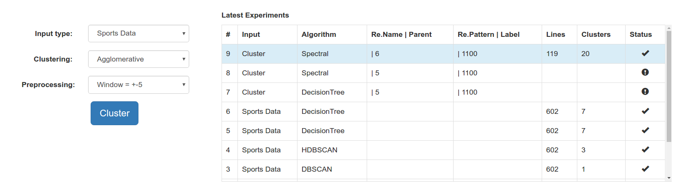
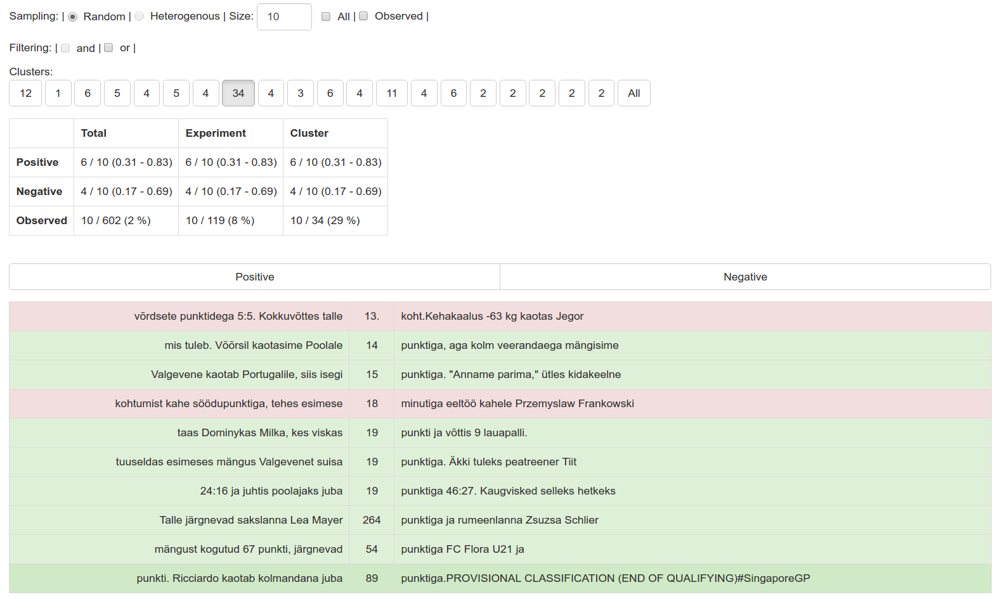

# Pattern Examiner
*Pattern examiner* is a a tool for evaluating the contents and similarity of large sets of data. The data can be clustered, sampled and filtered. This yields sufficient insight into the data without actually going through all of it manually.

## Features
* Context based clustering. Currently contains 5 different algorithms, including a custom decision tree based clustering algorithm, which uses different features for splitting and split goodness estimation. Clusters can be recursively clustered.
* Heterogenous and random sampling of the clusters. 
* Filtering the results.
* Evaluation: datapoints in a cluster can be assigned true/false values. 
* Cluster quality estimation, estimating Bernoulli trial probability from a small sample.

## Use cases
Currently *pattern examiner* is used as part of a semi-supervised learning system, where the it is used to assess the quality of previously extraced sentences. 

## Setup

    $ pip3 install -r requirements.txt
    $ pip3 install hdbscan
    $ ./main.py

## Screenshots

Running experiments:

Sampling, evaluation:

